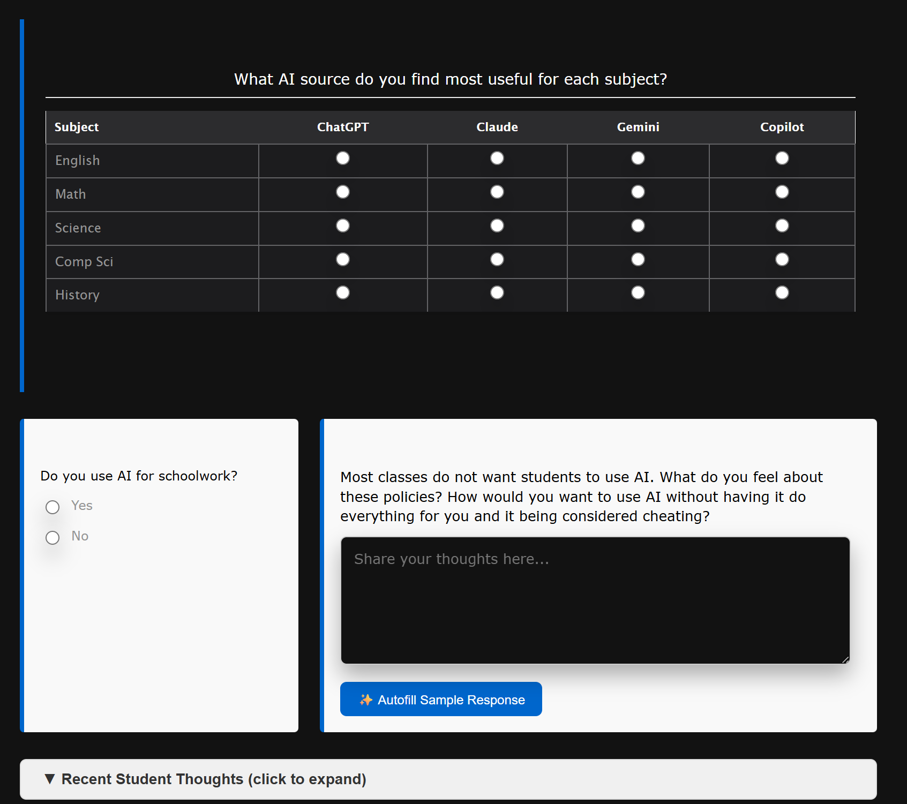
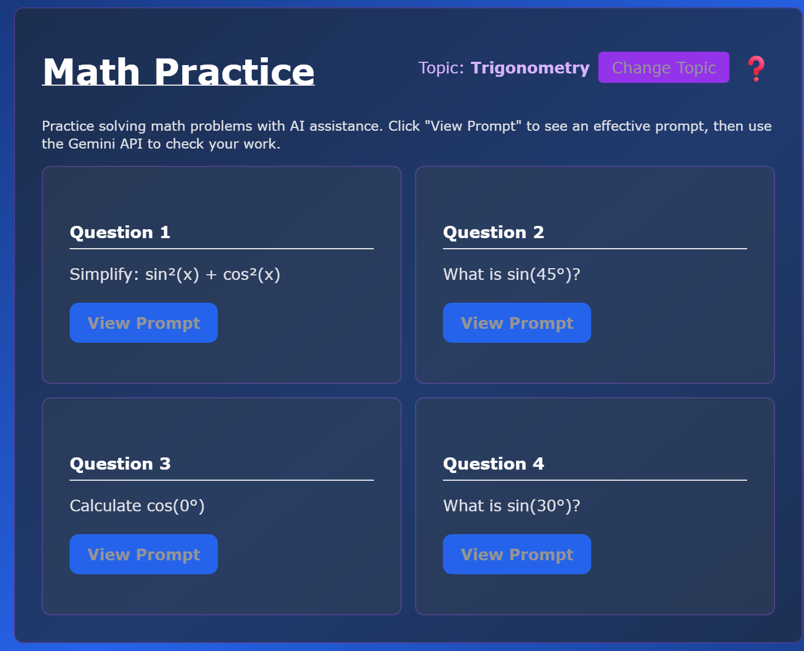
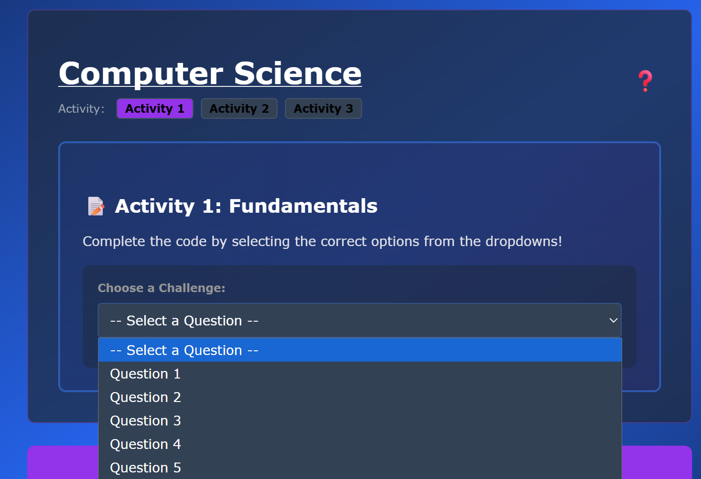
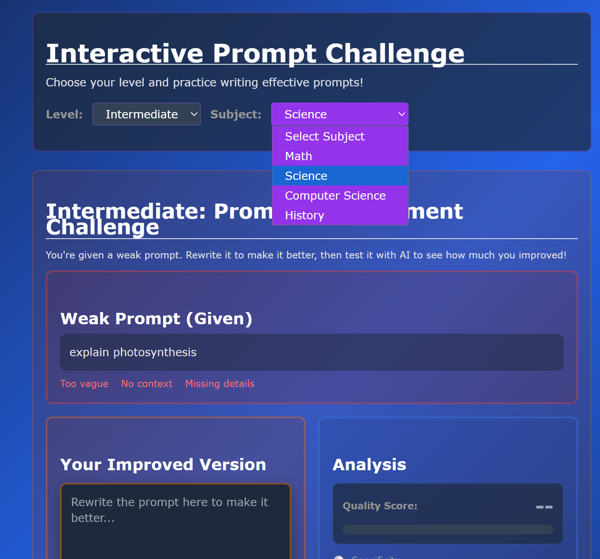

# Varada Vichare - Individual Review Blog 

## Pieces that I have been working on:

### Frontend Improvements

I worked on improving the frontend for both Submodule 1 and Submodule 2 based on user feedback. The main goal was to reduce unnecessary scrolling and make everything more concise and accessible.

**Submodule 1 - Before:**
- The "Show Previous Student Responses" section displayed a large amount of text all at once, taking up significant screen space.
- The two FRQ questions were stacked vertically one by one, requiring users to scroll extensively to view both questions.
- The layout felt cluttered and disorganized due to the amount of vertical space consumed.

**Submodule 1 - Improvements:**
- Minimized the "Show Previous Student Responses" section so it doesn't display all the text by default. Users can now click to expand it when they want to view past responses, keeping the interface clean.
- Repositioned the two FRQ questions side by side instead of stacking them vertically. This layout consumes less space and looks significantly more organized and neat.
- Overall reduction in scrolling required, making the user experience much smoother.

**Submodule 2 - Before:**
- Selecting subjects for Math and Science would redirect users to an entirely different screen just to pick what they wanted to work on.
- The four questions were displayed in a single vertical line, forcing users to scroll down continuously.
- Activity selection and question displays in the Computer Science section were large and took up excessive space.
- All text and instructions were visible at once, creating a visually overwhelming and distracting experience.

**Submodule 2 - Improvements:**
- Changed the theme and layout for every section to be more compact and user-friendly.
- For Math and Science, replaced the redirect screen with a simple dropdown menu where users can select their desired subjects directly without leaving the page.
- Reorganized the four questions into a square grid layout instead of a vertical stack, which takes up less space and appears more organized.
- For the Computer Science section, created smaller selective buttons for different activities and added dropdowns for the questions themselves, making everything more organized and less distracting.
- Added a question mark button to each section that users can click to expand additional information. This keeps unnecessary text hidden unless specifically needed.
- For the Challenge section, replaced large buttons with a dropdown for selecting difficulty levels and added another dropdown for selecting subjects, so users only see the specific Mad Lib outline or writing prompt relevant to their choice.

### Backend Development

For Submodule 1, I worked on the backend to handle staged data stored in the survey_responses table. The table includes:
- ID
- Whether the user uses AI or not
- FRQ response content
- Timestamp of submission
- Whether the user was rewarded a badge

There is a file called survey_results.py which generates the staged data by taking the ID and all associated information to create a structured table. This is visible on the frontend when you navigate to Submodule 1, where you can see over 100 responses reflected in the scaling of the bar graph, demonstrating real data visualization.

### Future Improvements

Moving forward, I plan to focus on several key enhancements:
- Making buttons clearer and more intuitive for users by improving labels and visual feedback.
- Implementing an overall less bright color scheme to reduce eye strain and create a more professional aesthetic.
- Adding more staged data to the survey responses table to provide a larger dataset for analysis and testing.
- Refining the dropdown menus to include better categorization and filtering options for improved navigation.